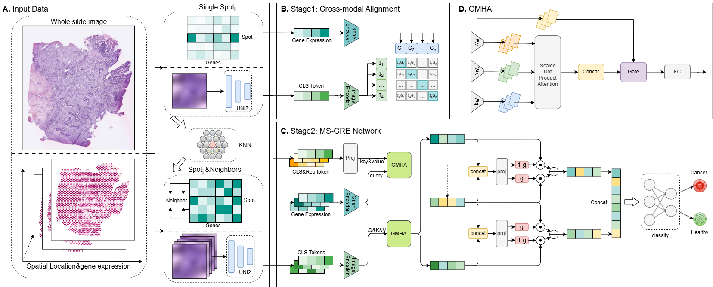

# SpaAGMF: Adaptive Gated Multi-Scale Fusion of Histology and Spatial Transcriptomics for Cancer Region Classification

# Introduction
Accurate classification of cancer tissue regions (CTR) in spatial transcriptomics is critical for understanding tumor heterogeneity and informing clinical treatment decisions. 
However, current computational methods struggle to bridge the semantic gap between high-dimensional transcriptomic profiles and complex histological images, while also being hindered by inherent noise and significant batch effects across clinical samples and sequencing platforms, thereby limiting their generalizability in real-world applications.
To address these challenges, we propose SpaAGMF, a novel adaptive gated multi-scale fusion framework. SpaAGMF integrates a pre-trained pathology foundation model to extract semantic histological features and employs a bidirectional contrastive learning strategy to align these visual patterns with transcriptomic profiles in a shared latent space. A core component of SpaAGMF is the Multi-Scale Gated Representation Extractor (MS-GRE), which uses a gated multi-head attention mechanism to adaptively fuse micro-scale details with macro-scale neighborhood contexts. 
We evaluated SpaAGMF on five spatial transcriptomics datasets encompassing various cancer types and sequencing platforms. Extensive experiments demonstrate that SpaAGMF consistently outperforms state-of-the-art methods in cross-sample, cross-platform and cross-batch classification tasks.

# Model Structure

**Figure 1.** (A) Multimodal input processing from whole slide images and spatial transcriptomics. (B) Stage 1: Cross-modal alignment using bidirectional InfoNCE loss. (C) Stage 2: The MS-GRE network, featuring gene-guided gated cross-attention for micro-scale features and neighborhood-aware gated self-attention for macro-scale context. (D) Detailed architecture of the GMHA module.

# Data
| Dataset | Data Type | Tumor Type | Spots | Tumor Ratio | Platform | Link| 
| :--- | :--- | :--- | :--- | :--- | :--- | :--- |
| CRC | Multi-slice | Colorectal Cancer | 17392 | 44.70% | Visium | [Link](https://zenodo.org/records/7760264.) |
| STHBC | Multi-slice | Breast Cancer | 3481 | 54.47% | ST | [Link](https://github.com/almaan/her2st) |
| XeHBC | Single-slice | Breast Cancer | 4050 | 36.84% | Xenium | [Link](https://www.10xgenomics.com/products/xenium-in-situ/preview-dataset-human-breast) |
| ViHBC | Single-slice | Breast Cancer | 3798 | 65.56% | Visium | [Link](https://zenodo.org/records/10437391) |
| IDC | Single-slice | Breast Cancer | 4727 | 55.19% | Visium | [Link](https://www.10xgenomics.com/datasets/invasive-ductal-carcinoma-stained-with-fluorescent-cd-3-antibody-1-standard-1-2-0) |

## Tutorial

- [View the tutorial](./tutorial.ipynb)

# Environment
conda create -n SpaAGMF python==3.10.20  
conda activate SpaAGMF  
pip install -r requirements.txt
